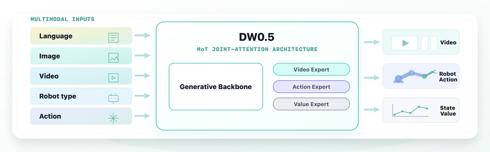
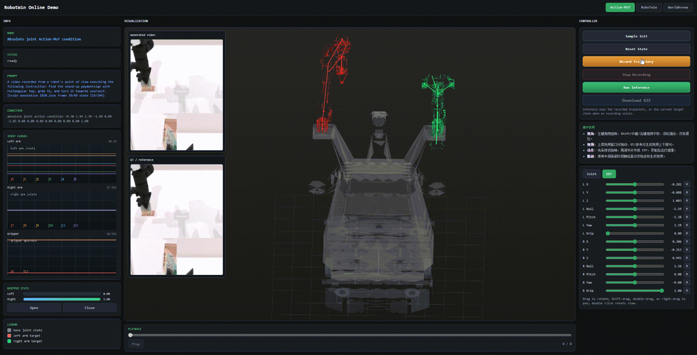

> **勘境 / KineWorld research fork:** 感谢原作者的开源贡献。See [KINEWORLD.md](KINEWORLD.md) for acknowledgements, our changes and validation limits. Original authorship and licenses are preserved.

<div align="center">
  
  <h1 style="font-size: 2.25em;">DW05: A Multimodal World Model for Embodied Intelligence</h1>
</div>

<div align="center">
  <a href="https://github.com/dexmal/opendw"></a>
  <a href="https://huggingface.co/Dexmal/DW05-Base"></a>
  <a href="https://maas.dexmal.com/"></a>
  <a href="#license"></a>
</div>

DW05 is a multimodal world model for embodied decision-making, designed to understand how actions shape future outcomes in robot environments. It unifies future video prediction, action generation, and state-value estimation in one framework, with released weights, inference code, and training code.

## Latest Updates

- 2026-07: Initial DW05 public release with weights and inference code.

## Architecture Scope

DW05 uses language, image/video, robot type, state, and action inputs for embodied world modeling. It follows an MoT framework where a Wan backbone is followed by three expert heads for video, action, and value modeling.

<div align="center">
  
</div>

Note: the Value Expert will be updated in a later release.

## Model Preparation

Download the released DW05 assets from Hugging Face:

| Model   | Description                                        | Checkpoint                                                            |
| ------- | -------------------------------------------------- | --------------------------------------------------------------------- |
| Base    | Base DW05 model pretrained on multi-source dataset | [🤗 Dexmal/DW05-Base](https://huggingface.co/Dexmal/DW05-Base)         |
| SFT-RBT | Robotwin 2.0 fine-tuned DW05 model for evaluation  | [🤗 Dexmal/DW05-Robotwin](https://huggingface.co/Dexmal/DW05-Robotwin) |

Example checkpoint download:

```bash
huggingface-cli download Dexmal/DW05-Base --local-dir ./checkpoints/DW05-Base
huggingface-cli download Dexmal/DW05-Robotwin --local-dir ./checkpoints/DW05-Robotwin
```

## Environment Setup

The recommended environment uses Python 3.10+ with a CUDA-enabled PyTorch build. Install this repository in editable mode:

```bash
cd /path/to/dexbotic-dw05
pip install -e .
```

Optional attention packages can be installed when they are compatible with your
CUDA/PyTorch stack:

```bash
pip install -e '.[attention]'
```

Common runtime environment variables:

```bash
export DW05_MODEL_BASE_PATH=/path/to/local/model/root
export DIFFSYNTH_MODEL_BASE_PATH=$DW05_MODEL_BASE_PATH
export TOKENIZERS_PARALLELISM=false
```

## Data Preparation

DW05 uses RobotWin-style episode annotations. Each episode is stored as JSONL,
where each line describes one frame. The dataset can read local paths or remote
paths through `megfile`, and local mirrors can be configured with path-prefix
overrides.

The README examples assume a small demo split constructed from three tasks in
our existing RobotWin-style dataset. The demo keeps complete episode JSONL files
for those tasks and follows the same directory structure as the full dataset:

```text
/path/to/dw05_demo/
  annotations/
    task_a/
      episode_000000.jsonl
      ...
    task_b/
      episode_000000.jsonl
      ...
    task_c/
      episode_000000.jsonl
      ...
  text_embeddings/
  norm_stats.json
```

The demo split is only for illustrating the expected layout and file format; the
training code consumes it in exactly the same way as the full dataset.

A DW05 sample is expected to provide:

- camera observations referenced by `images_1`, `images_2`, and `images_3`, or
  equivalent fields configured through `data_config.images_keys`;
- a `type` list containing `action`, `wm`, or both;
- a robot prompt at `robot.prompt` for action samples;
- a world-model caption at `worldmodel.caption` for video samples;
- robot `state`, optional `proprio`, and action trajectories;
- cached text embeddings, or a configured fallback for missing embeddings;
- optional normalization stats in `norm_stats.json` format.

One JSONL line has the following format. The same fields are repeated for each
frame in an episode, with `frame_idx`, image paths, and robot state updated per
frame:

```json
{"type":["action","wm"],"images_1":[{"type":"video","url":"videos/front/episode_000000.mp4","frame_idx":0}],"images_2":[{"type":"video","url":"videos/left/episode_000000.mp4","frame_idx":0}],"images_3":[{"type":"video","url":"videos/right/episode_000000.mp4","frame_idx":0}],"robot":{"prompt":"pick up the red block","state":[0.0,0.1,0.2,0.3,0.4,0.5,0.6,0.7,0.8,0.9,1.0,1.1,1.2,1.3],"subtask":"reach the red block"},"worldmodel":{"caption":"A video recorded from a robot's point of view executing the following instruction: pick up the red block"},"robot_task_success":1}
```

For image-only storage, replace each video item with
`{"type":"image","url":"images/front/frame_000000.jpg"}`. For action-only norm
stat computation, `type`, `robot.prompt`, and `robot.state` are sufficient, but
full training samples should include camera observations and cached text
embeddings for the selected prompts/captions.

Set the dataset paths with environment variables:

```bash
export DW05_ROBOTWIN_ANNOTATIONS=/path/to/dw05_demo/annotations
export DW05_ROBOTWIN_TEXT_EMBED_DIR=/path/to/dw05_demo/text_embeddings
export DW05_ROBOTWIN_NORM_STATS_PATH=/path/to/dw05_demo/norm_stats.json
export DW05_ROBOTWIN_DATA_PATH_PREFIX=/path/to/media/root
export DW05_ROBOTWIN_INDEX_PATH_PREFIX=/path/to/dw05_demo/annotations
```

The built-in recipe is `robotwin_baseline`, registered in
`dexbotic/data/dataset/dw05/data_source.py`. You can also bypass the built-in
recipe with explicit experiment overrides:

```bash
python playground/example_dw_exp.py --task smoke \
  data_config.annotations=/path/to/annotations \
  data_config.data_path_prefix=/path/to/media/root \
  data_config.index_path_prefix=/path/to/index/root \
  data_config.text_embedding_cache_dir=/path/to/text_embeddings \
  data_config.norm_stats_path=/path/to/norm_stats.json
```

If remote media paths are mirrored locally, set one or more mirror roots with
the platform path separator:

```bash
export DW_LOCAL_MIRROR_PREFIXES=/local/mirror/root
```

Compute action normalization stats for a local dataset:

```bash
python playground/example_dw_exp.py --compute-norm-stats \
  data_config.annotations=/path/to/annotations \
  data_config.data_path_prefix=/path/to/media/root \
  data_config.text_embedding_cache_dir=/path/to/text_embeddings \
  norm_stats_config.norm_save_path=./runs/dw05/norm_stats \
  norm_stats_config.batch_size=128 \
  norm_stats_config.max_batches=500
```

The output file is:

```text
./runs/dw05/norm_stats/norm_stats.json
```

Use this file as `data_config.norm_stats_path`, `DW05_ROBOTWIN_NORM_STATS_PATH`,
or the runtime `--norm-stats-path` argument where available.

## Inference

### Action-conditioned RobotWin demo

We visualize an action-conditioned RobotWin rollout, where DW05 predicts the future video conditioned on robot observations and actions. The corresponding demo entrypoint is `playground/online_demos/robotwin_online_demo.py`.

<div align="center">
  
</div>

### Open-loop image inference

Use the main experiment entrypoint for a simple image-conditioned rollout:

```bash
python playground/example_dw_exp.py --task inference \
  inference_config.checkpoint_path=/path/to/dw05_checkpoint.pt \
  inference_config.input_image_path=/path/to/condition.png \
  inference_config.prompt="A video recorded from a robot's point of view executing the following instruction: open the drawer" \
  inference_config.output_mp4=./runs/dw05/inference.mp4 \
  inference_config.num_inference_steps=10
```

This writes the generated video to `inference_config.output_mp4`.

### Action-conditioned JSONL inference

Use the ALOHA/RobotWin-style single-sample script when you want inference from a
JSONL episode frame with action and proprio conditioning:

```bash
python script/dw/infer_aloha_joint.py \
  --ckpt /path/to/dw05_checkpoint.pt \
  --jsonl /path/to/episode.jsonl \
  --frame-index 0 \
  --model-base-path /path/to/local/model/root \
  --output-dir ./runs/dw05/aloha_joint_sample \
  --device cuda:0 \
  --num-inference-steps 4 \
  --num-video-frames 9 \
  --action-horizon 32
```

The script saves visualizations, `pred_action.pt`, and `metadata.json` under the
output directory.
